# Unified Biomedical Knowledge Graph
## GenCode ingestion script

### Purpose
The scripts in this folder generate files in UBKG edges/nodes format for ingestion of data from GenCode.

### Content
- **gencode.py** does the following:
  - downloads GZIPped files from the GenCode FTP site, including:
     - the main annotation file
     - metadata files for 
        - Entrez Gene
        - RefSeq
        - UniProt/SwissProt
        - UniProt/TrEMBL
  - expands GZIP files to GTF files.
  - translates the annotation file by:
    - extracting and collecting values from the key-value column (9th column)
    - merging with the metadata files 
  - filters annotation output based on indications in the configuration file.
  - uses the translated annotation data to build edges and nodes files.
- **gencode.ini.example**: annotated example of an application configuration file.

### File Dependencies
1. Files in the **ubkg_utilities** folder:
   - ubkg_extract.py
   - ubkg_logging.py
   - ubkg_config.py
2. An application configuration file named **gencode.ini.**

### Precursor Assertions
Some GenCode assertions employ nodes from other sets of assertions, including:
1. GENCODE_VS: a custom valueset generated from a source file built with the SimpleKnowledge framework
2. PGO: Pseudogene Ontology

Note: In the UBKG, codeIDs for PGO nodes are in the format **PGO PGO:(code)**, similar to the formats for GO, HPO, and HGNC.

#### GENCODE_VS
GENCODE_VS is a special case. The GENCODE annotated file refers to nodes in GENCODE_VS by term instead of code,
so it is necessary to map from term to code in GENCODE_VS. The script assumes that GENCODE_VS has been ingested so 
that the file **OWLNETS_node_metadata.txt** is available.

Codes in GENCODE_VS are obtained from the [biotypes](https://www.gencodegenes.org/pages/biotypes.html) page of the GENCODE website.

### To run
Copy and modify **gencode.ini.example** to a file named **gencode.ini** in the gencode directory.

# GenCode Model

Each row in the translated annotation file corresponds to a GenCode annotation.
Each annotation can correspond to a set of assertions in the UBKG.

GenCode assertions involve the following types of nodes:
1. annotation nodes (i.e., identified with Ensembl IDs; created as part of the GENCODE ingestion) 
2. nodes from the GENCODE_VS ontology.
3. RefSeq nodes (which are created as part of the GENCODE ingestion)

## Decomposition and translation of the 9th column in annotation GTF file
The format of data in the annotation GTF file is described [here](https://www.gencodegenes.org/pages/data_format.html).
The ninth column of data for each annotation is a set of delimited key-value pairs.
The key-value column uses two levels of delimiting:
 - Level 1 - delimiter between key/value pairs = ;
 - Level 2 - delimiter between key and value = ' '

 Excerpt of a key-value column (from the general annotation GTF):

    `"gene_id "ENSG00000223972.5"; transcript_id "ENST00000456328.2"; gene_type "transcribed_unprocessed_pseudogene"; gene_name "DDX11L1";"`

Key/value pairs do not have static locations--i.e., a key/value pair may be in column X in one row and column Y 
in another. Furthermore, some keys have multiple values in the same row. For example, row 11 of the annotation shows 
tag "basic" in column 11 and tag "Ensembl_canonical" in column 12.

This means that the key-value columns after the Level 1 split will resemble the following
(x, y, z, a are keys):

| columns | 1   | 2   | 3   | 4   |
|:--------|-----|-----|-----|-----|
| 0       | x20 |     |     |     |
| 1       | x30 |     |     |     |
| 2       |     | x40 |     |     |
| 3       | a99 |     |     |     |
| 4       | y25 | z30 | x50 | x60 |
(note multiple values for the x key in the fourth row)

The desired result if search_key = x is a series of values corresponding to key=x,
sorted in the original row order, with multiple values collected into lists--e.g.,

| x       |
|---------|
| 0 20    |
| 1 30    |
| 2 40    |
| 3       |
| 4 50 60 |

## Transcript-specific Assertions

An annotation node that corresponds to a transcript can be the subject in the following types of assertions:

| predicate  IRI                            | predicate label  | column in annotation file | node type       |
|-------------------------------------------|------------------|---------------------------|-----------------|
| http://purl.obolibrary.org/obo/RO_0002510 | transcribed_from | gene_id                   | annotation node |
| http://purl.obolibrary.org/obo/RO_0002205 | has_gene_product | UNIPROTKB_SwissProt_AN    | UNIPROTKB       |
| http://purl.obolibrary.org/obo/RO_0002205 | has_gene_product | UNIPROTKB_Trembl_AN       | UNIPROTKB       |

### transcribed_in
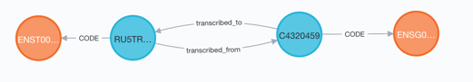
### has_gene_product
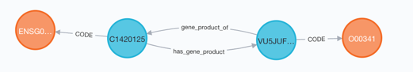

## Feature-level Assertions

Every annotation node can be the subject of a number of assertions.
Node_ids for object nodes are from:
1. Nodes in the **OWLNETS_node_metadata.txt** file created during the ingestion of the GENCODE_VS SAB
2. Nodes from the PsuedoGene Ontology (PGO), ingested from an OWL file.

| predicate  IRI                              | predicate label       | column in annotation file | node type   |
|---------------------------------------------|-----------------------|---------------------------|-------------|
| 'http://purl.obolibrary.org/obo/RO_0001025' | located_in            | chromosome_name           | GENCODE_VS |
|                                             | is_feature_type       | feature_type              | GENCODE_VS |
|                                             | is_gene_biotype       | gene_type                 | GENCODE_VS |
|                                             | is_transcript_biotype | transcript_type           | GENCODE_VS |
| http://purl.obolibrary.org/obo/RO_0004048   | has_directional_form  | genomic_strand            | GENCODE_VS |
| subClassOf                                  | isa                   | ont                       | PGO         |
|                                             | has_RefSeq_ID         | RefSeq_RNA_id             | REFSEQ      |

### located_in
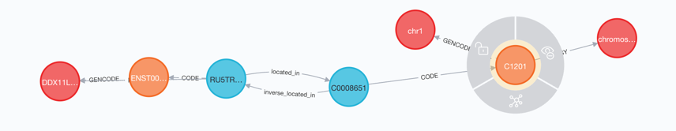
### is_feature_type
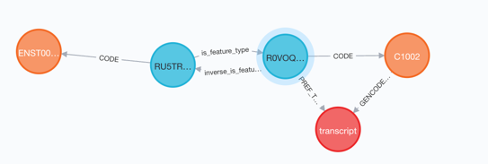
### is_gene_biotype
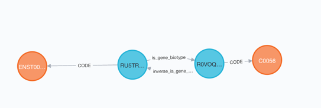
### is_transcript_biotype
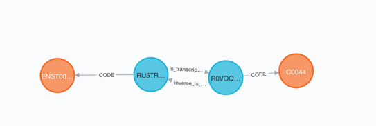
### has_directional_form
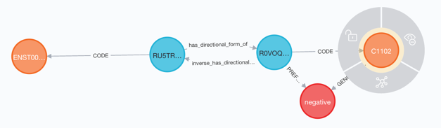
### subClassOf (PGO)
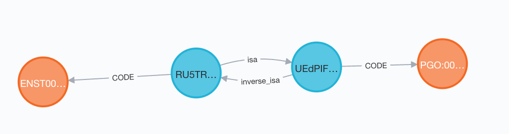
### has_RefSeq_ID (RNA)
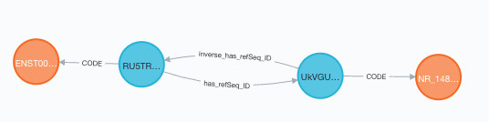
### has_RefSeq_ID (protein)
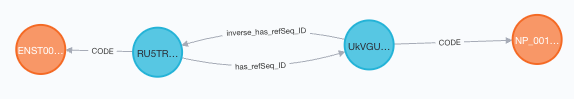

## Node information

### Annotation nodes
Each annotation node has the following characteristics:

| fields in annotation file | characteristic                              |
|---------------------------|---------------------------------------------|
| genomic_start_location    | **lowerbound** property                     |
| genomic_end_location      | **upperbound** property                     |
| HGNC ID                   | dbxref to HGNC node                         |

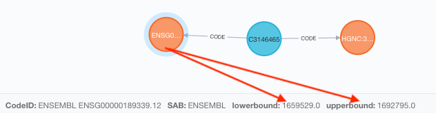

### Entrez nodes
A node will be created for each value in the _Entrez_Gene_id_ field of the annotation file.
These nodes have dbxrefs to HGNC nodes.

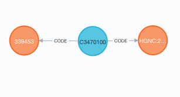

### RefSeq nodes
A node will be created for each value in the _RefSeq_RNA_id_ or _RefSeq_protein_id_ field of the annotation file. 
RefSeq nodes will be in **has RefSeq** assertions.

### Ensembl IDs
GenCode includes the version number in the Ensembl ID of a gene or transcript--e.g., ENSG00000227232.5.
Other references usually do not use the version number.

The script:
1. Stores in **node_id** (which becomes the CodeID of the node) the Ensembl ID without the version number.
2. Stores the version number in the **value** property.