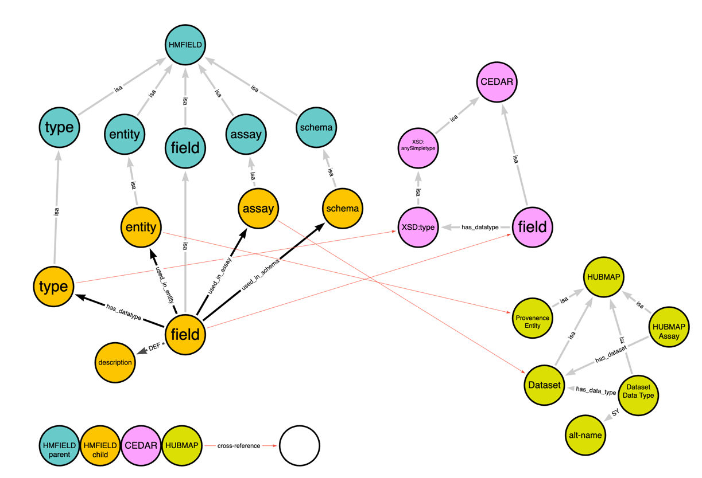

# Unified Biomedical Knowledge Graph
## HMFIELD ingestion script

### Purpose
The script in this folder generates files in UBKG edges/nodes format for an ontology with SAB **HMFIELD**. 

### Script Content
- **hmfields.py**: translates YAML content into a ontology graph in UBKG 
- **hmfields.ini.example**: Annotated example configuration file for script

### Script File Dependencies
1. Files in the **ubkg_utilities** folder:
   - ubkg_logging.py
   - ubkg_config.py
2. An application configuration file named **hmfields.ini.** Create this file by copying **hmfields.ini.example**.

### Script Content
- **hmfields.py**: translates YAML content into a ontology graph in UBKG 
- **hmfields.ini.example**: Annotated example configuration file for script

### UBKG Dependency
Unlike other ingestions, the HMFIELD ontology queries an instance of
UBKG directly to find codes to use in assertions. The script calls endpoints
of the UBKG API. 

### CEDAR Dependency and refreshing HMFIELD
HMFIELD codes are cross-referenced, where possible, to CEDAR field codes. This means that the
HMFIELD ontology has a dependency on the currency of CEDAR data.

To obtain information on CEDAR for cross-referencing, HMFIELD queries the UBKG using the 
UBKG API. This means that **refreshing** HMFIELD data in the UBKG requires an instance of UBKG with
the latest CEDAR data. This is often the very instance of UBKG that is being refreshed.

To ingest HMFIELD into UBKG,
1. Ingest all other sources in the HMSN context.
2. Build a new local instance of UBKG.
3. Configure **hmfields.ini** so that it points to the local instance of the UBKG.
4. Ingest HMFIELD.
5. Rebuild the local instance.

If the field-*.yaml files are not deprecated, the ETL could be modified so that it uses the CEDAR edge/node files directly.

# The HMFIELD Ontology
### Background
HuBMAP recently integrated CEDAR into the ingest metadata validation workflow. Prior to CEDAR, ingest metadata was validated using infrastructure based on source in the [ingest-validation-tools repository](https://github.com/hubmapconsortium/ingest-validation-tools). 

Starting in 2023, CEDAR applications will validate ingest metadata. 

As part of the CEDAR integration, the UBKG was enhanced to model CEDAR template and field information. This included an ETL script that reads from CEDAR template data in UBKG edges nodes format.

Although much of the function of the [ingest-validation-tools](https://github.com/hubmapconsortium/ingest-validation-tools) repository has been replaced with CEDAR, the Data Portal UI depends on a set of YAML files that currently reside in the docs directory. The files describe metadata fields used in datasets ingested prior to the CEDAR integration.

| File                                                                                                                          | Description                                            | Usage by Portal UI                                                                                                                                                                                                                                                                                                                     |
|-------------------------------------------------------------------------------------------------------------------------------|--------------------------------------------------------|----------------------------------------------------------------------------------------------------------------------------------------------------------------------------------------------------------------------------------------------------------------------------------------------------------------------------------------|
| [field_descriptions.yaml](https://github.com/hubmapconsortium/ingest-validation-tools/blob/main/docs/field-descriptions.yaml) | field descriptions                                     | Provides descriptions used most prominently in metadata tables and the tsv downloads we make available.                                                                                                                                                                                                                                |
| [field_types.yaml](https://github.com/hubmapconsortium/ingest-validation-tools/blob/main/docs/field-types.yaml)               | Defines data types for fields                          | Provides field types used in lineup, the beta search UI and elasticsearch queries to search-api throughout the portal. You have to adapt elasticsearch query clauses to the types of the fields included in the clause. This is especially important for the aggregation queries which populate the filters shown on the search pages. |
| [field_entities.yaml](https://github.com/hubmapconsortium/ingest-validation-tools/blob/main/docs/field-entities.yaml)         | Associates fields with provenance entities             | Provides field/entity relationships used in the beta search UI to determine which fields to make available for a given entity search page.                                                                                                                                                                                             |
| [field_assays.yaml](https://github.com/hubmapconsortium/ingest-validation-tools/blob/main/docs/field-assays.yaml)             | Associates fields with HuBMAP “assays” (dataset types) | Provides field/assay relationships used in the beta search UI to show the fields relevant to the assay type selections the user has made in the configure search menu.                                                                                                                                                                 |
| [field_schemas.yaml](https://github.com/hubmapconsortium/ingest-validation-tools/blob/main/docs/field-schemas.yaml)           | Associates fields with metadata schemas                | Unknown                                                                                                                                                                                                                                                                                                                                |

# Modeling HMFIELD in UBKG
## Challenges
### Encoding 
Legacy metadata in the YAML files is represented with string terms and should be encoded. For example, the field ablation_distance_between_shots_x_units in the YAML files will be encoded as HMFIELD:10001.

### Cross-references to CEDAR and HUBMAP
When possible, nodes created from the YAML files should be cross-referenced to equivalent nodes in the HUBMAP and CEDAR ontologies. This will facilitate metadata analysis that spans datasets ingested both prior to and after CEDAR.

The ingestion of data from the YAML files requires that the ETL script query an instance of the UBKG to obtain cross-references.

### Assay identification
The YAML files identify assays differently than does the HUBMAP application ontology.

Currently, each “assay” (dataset type) in HuBMAP has three properties that can be used to identify the dataset type:
- The _data_type_, which is used both in the metadata.tsv files and as a unique key in processing workflows.
- The _display name_ (or description), used in faceted search in the Portal.
- A set of _alt-names_, or synonyms for _data_type_.

An example of a dataset type with all three properties is **scRNA-seq (10x Genomics v3)**:
- _data_type_: scRNAseq-10xGenomics-v3
- _display name_: scRNA-seq (10x Genomics v3)
- _alt-names_: 
  - scRNA-Seq(10xGenomics)
  - scRNA-Seq-10x
  - scRNAseq-10xGenomics

The **field_assays.yaml** file maps fields to assays using combinations of _data_type_ and _alt-name_. 
For example, the **field acquisition_instrument_model** is mapped to:
- 3D Imaging Mass Cytometry, an alt-name for the dataset with data_type IMC3D
- scRNAseq-10xGenomics, a data_type

In other words, the YAML file treats _data_type_ and _alt-name_ as equivalent identifiers, while HuBMAP treats them as separate identifiers. 

## UBKG ontology for the legacy ingest metadata
### Simplified Model 
The UBKG:
- represents each entity (e.g., “field”) of an ontology with a set of interrelated nodes and edges, including 
  - Concept
  - Code
  - Term
  - Definition
- represents properties of entities as nodes (known as property nodes) 

The large number of infrastructural nodes and edges can obscure relationships of interest to modeling an ontology.

In the following simplified model, each entity node (circle) represents a set of related Concept, Code, and Term nodes in the actual UBKG. Edges that are relevant to the HMFIELD ontology are explained in the following section.

## Translations of YAML files for HMFIELD
### Ontology nodes
The ETL creates the following nodes to establish an ontology with SAB HMFIELD:
- A HMFIELD ontology root
- Parent nodes that are child nodes of the HMFIELD ontology root node:
  - field 
  - schema
  - type 
  - assay
### From field_descriptions.yaml
#### Nodes
For each field in the YAML, the ETL creates:
- a field node (child of the field parent node).
- a description property node linked to the field node (actually, to the Concept node for the field, not shown in the simplified model).
#### Edges
None
#### Cross-references
When possible*, the ETL cross-references a HMFIELD field node to a field node in the CEDAR template ontology, based on the description string in the YAML. 

For example, the field named area_value in the YAML is cross-referenced to the field in CEDAR with code CEDAR:b01e3d55-d93c-4c3b-ba26-68c612b74e7e.

*The cross-referencing of a field from the YAML to a CEDAR code depends directly on the ingestion of CEDAR template data.

### From field_types.yaml
#### Nodes
The type for each field in the YAML is converted to a type node (child of the type parent node).
#### Edges
The ETL asserts has_datatype edge between HMFIELD field and type nodes, to match the way that fields map to types in CEDAR.
#### Cross-references
The ETL cross-references each HMFIELD type node to a XSD type node in the CEDAR ontology, with the following special mappings: 
- The YAML file uses the type number, for which there is no equivalent in XSD. The ETL script cross-references the type number to XSD:float.
- The YAML file uses the type datetime. The ETL script cross-references the datetime type to XSD:dateTime.

### From field_entities.yaml
#### Nodes
For the unique set of entities listed in the YAML, the ETL creates an entity node (child of the entity parent node).
#### Edges
The ETL asserts used_in_entity edges between HMFIELD field and entity nodes.
#### Cross-references
The ETL cross-references each HMFIELD schema node to a corresponding Provenance Entity node from the HUBMAP application ontology. The provenance entities are:
- Dataset
- Sample
- Publication Entity
- Upload
- Antibodies
- Contributors

#### Changes to HUBMAP ontology
The HUBMAP application ontology did not include a Provenance Entity node hierarchy, unlike the SENNET application ontology. 

A Provenance Entity node hierarchy was added to HUBMAP to support both
- the HMFIELD ingest
- a port of the SenNet metadata validation to HuBMAP

### From field_assays.yaml
#### Nodes
The ETL script converts each “assay” listed in the YAML to an assay node (child of the assay parent node).
#### Edges
The ETL asserts used_in_dataset edges between HMFIELD field and assay nodes.
#### Cross-references
The ETL cross-references each HMFIELD assay node to a Dataset node from the HUBMAP application ontology. In other words, the ETL script does not cross-references to the equivalent of data_type or alt-name, but to the HuBMAP dataset type.

In the HUBMAP graph, 
A _data_type_ is represented with a **Dataset Data Type** property node linked to a **Dataset** node.
An _alt-name_ is represented with a **Term** node with a SY edge to the **Dataset Data Type** node. 
In other words, an _alt-name_ is a synonym for a _data_type_.

A **Dataset** node thus acts as a container for nodes representing _data_type_ and _alt-name_.

The YAML file refers to assays (dataset types) using both _data_type_ and _alt-name_, 
treating  them as equivalent properties that are kept separate in HUBMAP. 
The ETL cross-referencing preserves both forms of assay identification.

##### Example
The field **acquisition_instrument_model** maps to assays as follows:

| assay                | type of identifier | Cross-referenced HUBMAP Dataset Type |
|----------------------|--------------------|--------------------------------------|
| scRNAseq-10xGenomics | alt_name           | scRNA-seq (10x Genomics v2) Dataset  |
| bulk-RNA             | data_type          | bulk-RNA                             |

### From field_schemas.yaml
#### Nodes
For the unique set of schemas listed in the YAML file, the ETL script creates a schema node (child of the schema parent node). 
#### Edges
The script asserts used_in_entity edges between HMFIELD field and schema nodes.
#### Cross-references
The HUBMAP application ontology currently does not include a schema node hierarchy. There is currently no use case for metadata schemas in HUBMAP. The ETL does not cross-reference HMFIELD schema nodes.

