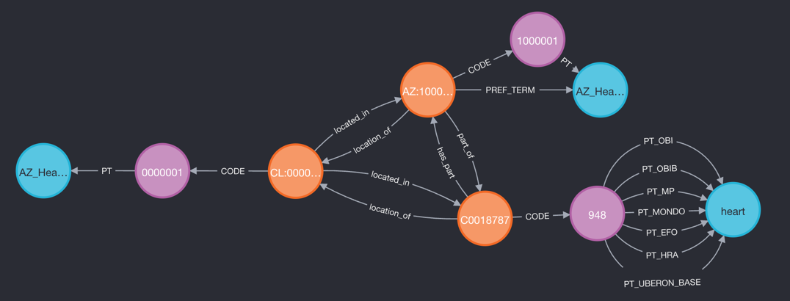

# Human Reference Atlas Cell Annotation Digitial Object  to OWLNETS converter

Uses cell annotation Digital Objects in the [Human Reference Atlas](https://apps.humanatlas.io/kg-explorer/?do=ctann) (HRA) Knowledge Graph site
to generate a set of text files that comply with the OWLNETS format, as described [here](https://github.com/callahantiff/PheKnowLator/blob/master/notebooks/OWLNETS_Example_Application.ipynb).


# Content
- **hra_do.py** - Does the following:
   - Reads the configuration file **hra_do.ini**
   - Downloads the cell annotation crosswalk CSV that corresponds to the SAB argument.
   - Generates files in OWLNETS format based on the spreadsheet.
- **skowlnets.ini** - INI file with URL links to the HRA cell annotation crosswalk CSVs


# Arguments
1. The SAB for the ontology--e.g., AZ, PAZ

# Dependencies
1. Files in the **ubkg_utilities** folder:
   - ubkg_extract.py
   - ubkg_logging.py
   - ubkg_config.py
   - ubkg_parsetools.py
2. An application configuration file named **hra_do.ini.**
3. A cell annotation CSV.

# To run
1. Modify **hra_do.ini**.
2. Configure the **ontologies.json** file at the generation_framework root to call hra_do.py with the appropriate SAB.


# Format of HRA cell annotation crosswalk CSVs

Cells of a cell type can be located in multiple anatomical areas. 
The generation script will concatenate information specific to an annotation to create unique 
preferred terms.

Each CSV has 10 header rows that can be skipped for ingestion.

## Example row

from the Azimuth crosswalk CSV:

| Organ_Level | Organ_ID      | Annotation_Label | Annotation_Label_ID | CL_Label  | CL_ID      |
|-------------|---------------|------------------|---------------------|-----------|------------|
| Heart_L2    | UBERON:000094 | Adipocyte        | AZ:0000001          | adipocyte | CL:0000136 |


#### Column A: Organ_Level
Corresponds to an anatomical region in which the cell type is located.
For pan-organ annotations, the organ level will be "body proper".

#### Column B: Organ_ID
Uberon code for the organ of which the organ_level is part.

#### Column C: Annotation_Label
Name for the cell type annotation

#### Column D: Annotation_Label_ID
Unique code for the cell type annotation in format SAB:code

#### Column E: CL_Label
Term for the cross-referenced code from Cell Ontology for the cell type annotation

#### Column F: CL_ID
Cross-referenced code from Cell Ontology for the cell type annotation

#### Column G: CL_Match
Level of SKOS match between the cell type annotation and its Cell Ontology cross-reference

# ETL Algorithm

## Nodes file
1. Define a **root node** for the cell type annotation SAB (e.g., AZ:0000000).
2. Define a **parent node** for the _annotation organ level_.
3. Define a **parent node** for the _annotation cell type_.
4. Define organ level nodes:
   1. Get the set of unique values of **Organ_Level** and **Organ_ID**. 
   2. Define a node for each unique value of organ level with
      1. term = **sab**_**Organ_Level**
      2. code relative to the parent node's code
5. For each annotation row in the CSV, define a node with
   1. code = **Annotation_Label_ID**
   2. term = concatenate SAB + **Organ_Level** + **Annotation_Label**
   3. dbxref = **CL_ID**
   4. synonyms = **Annotation_Label**

## Edges file
1. Assert **isa** relationships between 
   1. the annotation organ level parent node and the root node
   2. the annotation cell type parent node and the root node 
   3. each organ level node and the annotation organ level parent node
2. For each organ level node, assert a **part_of** relationship with the UBERON code in the OrganID column.
3. For each annotation row in the CSV, assert a **located_in** relationship with the organ level identified in the Organ Level column.

# Result in UBKG
Following is the information from the previous example row from a crosswalk CSV, represented in the UBKG.

```
match (tAnn:Term)<-[rAnn:PT]-(cAnn:Code {CodeID:'AZ:0000001'})<-[:CODE]-(pAnn:Concept)-[rloc:located_in]->(pOrganLevel:Concept), 
(pOrganLevel:Concept)-[rp:part_of]->(pOrgan:Concept)-[:CODE]->(cU:Code{SAB:'UBERON'})-[rU:PT_UBERON_BASE]->(tU:Term), 
(pOrganLevel:Concept)-[:CODE]->(cOrganLevel:Code{SAB:'AZ'})-[rOrganLevel:PT]->(tOrganLevel:Term)
WHERE rAnn.CUI=pAnn.CUI and rloc.SAB='AZ' AND rU.CUI=pOrgan.CUI  AND rOrganLevel.CUI=pOrganLevel.CUI RETURN *
```
