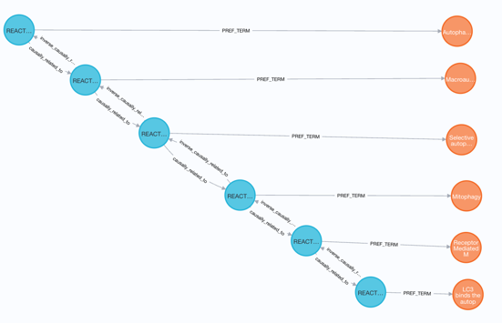
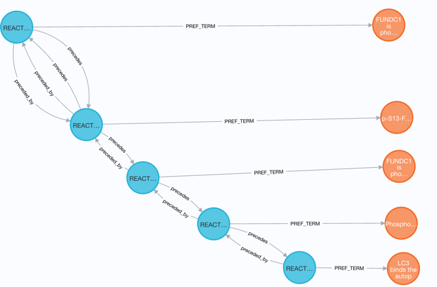
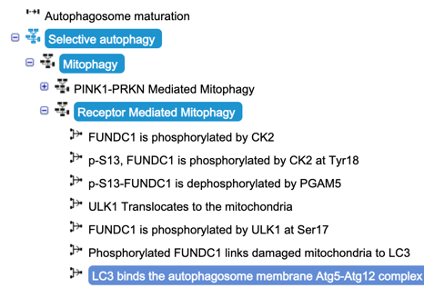
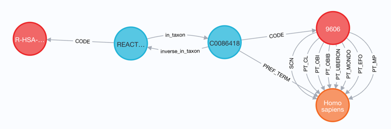
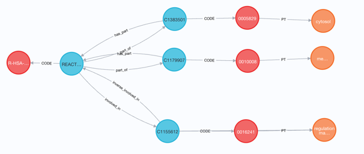
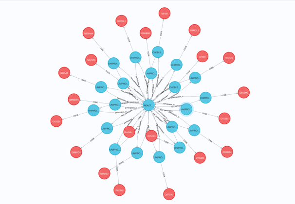

# Unified Biomedical Knowledge Graph
## Reactome ingestion script

### Purpose
The scripts in this folder generate files in UBKG edges/nodes format for ingestion of data from [Reactome](https://reactome.org/).

### Scope

Reactome contains information on bilogical pathways. 

In the Reactome model,
+ *Events* are organized into an *event hierarchy*. The event hiearchy is a tree structure that groups *ReactionLikeEvents* into *Pathways*.
+ *ReactionTypeEvents* include *Reactions*, *BlackBoxEvents*, and other types of events.
+ ReactionTypeEvents have molecules as inputs or outputs.
+ Molecules are of two types:
  + *Reference entities* with invariant properties, encoded to UniProtKB (proteins), CHEBI (molecules), or ENSEMBL (transcripts).
  + *Physical entities*, corresponding to *complexes* in Reactome, or combination of molecules

The known use cases for using Reactome data in the UBKG involve relationships between pathways and genes, with genes
being producers of proteins. For this reason, the ingestion of Reactome is limited to relationships between ReactionTypeEvents
reference entities (e.g., proteins).

### Methodology
The ingestion script interrogates Reactome by means of its Content Services API: in particular, the endpoints listed below.
+ https://reactome.org/ContentService/#/events/getEventHierarchy
+ https://reactome.org/ContentService/#/query/findEnhancedObjectById
+ https://reactome.org/ContentService/#/participants/getParticipatingReferenceEntities

### Content
- **reactome.py** does the following:
   - Loops through the set of species specified in the configuration file.
   - Calls endpoints of the Reactome Content Services API.
   - Translates information from endpoints into edges and nodes.

- **reactome.ini.example**: annotated example of an application configuration file.

### File Dependencies
1. Files in the **ubkg_utilities** folder:
   - ubkg_extract.py
   - ubkg_logging.py
   - ubkg_config.py
2. An application configuration file named **reactome.ini.**


#### REACTOME_VS
The responses from the Content Services API include string values that are categorical--in paticular, event types like "Reaction" and "Pathway".

Reactome does not expose the codes encode its categorical values, so it is necessary to mint
codes that are specific to the UBKG. 

REACTOME_VS is a special ontology that replicates the [Event](https://reactome.org/content/schema/Event) hierarchy of the Reactome Data Model.
The REACTOME ETL script assumes that REACTOME_VS has already been ingested so that its edge file is available.

### To run the ingestion script
1. Copy and modify **reactome.ini.example** to a file named **reactome.ini** in the reactome directory.
2. Execute **build_csv.sh -v REACTOME**.

# Reactome assertions in UBKG
Where possible, UBKG assertions use relationships from the Relations Ontology. Reactome does not
expose the codes used for its relationships. 

The Reactome ingestion script translates information from Reactome into assertions that conform to the UBKG model.

## Event Hierarchy
### causally_related_to / inverse_causally_related_to

The Reactome data model links events in the Reactome event hiearchy by means of a relationship named *has_event*.
The UBKG emulates the Reactome event hierarchy with assertions that use the *[causally_related_to](http://purl.obolibrary.org/obo/RO_0002410)* relationship from RO.

#### Example
It is possible to represent the Reactome event hierarchy in the UBKG using the **apoc.expand** feature. 
The following query shows the path from the concept for the "top level pathway" 
**Autophagy** (R-HSA-9612973) down to the concept of one of the terminal reactions 
of the pathway, **LC3 binds the autophagosome membrane Atg5-Atg12 complex** (R-HSA-8959571).

The resulting path replicates the information that can be seen in the
Reactome content detail pages by navigating through the events in the 
*Participants* and *Participates* sections.

```commandline
CALL
{
	MATCH (p:Concept {CUI: 'REACTOME:R-HSA-9612973 CUI'})
	CALL apoc.path.expand(p, 'causally_related_to>', null, 1, 9)
	YIELD path
	RETURN path, length(path) AS hops
	ORDER BY hops DESC LIMIT 1	
}

WITH path
UNWIND(nodes(path)) AS n
// Obtain preferred terms for Concept nodes.
OPTIONAL MATCH (n)-[:PREF_TERM]->(t:Term)

RETURN path, t
```



## Assertions from the Pathway Browser 
### precedes / preceded_by
The response of the **query** endpoint of the Content Services API for a Reactome event
includes the *precedingEvent* array of events that precede the specified event in a pathway. These links are represented 
in the [Reactome Pathway Browser](https://reactome.org/PathwayBrowser/).

The Reactome ingestion script translates each event in the *precedingEvent* array into an assertion that uses the 
*[preceded_by](http://purl.obolibrary.org/obo/BFO_0000062)* relationship from RO, with the inverse relationship of **preceded_by**.

#### Example
The following query shows how events are ordered ending with R-HSA-8959571 
(LC3 binds the autophagosome membrane Atg5-Atg12 complex):

```commandline
CALL
{
	MATCH (p:Concept {CUI: 'REACTOME:R-HSA-8959571 CUI'})
	CALL apoc.path.expand(p, '<precedes', null, 1, 9)
	YIELD path
	RETURN path, length(path) AS hops
	ORDER BY hops DESC LIMIT 1	
}

WITH path
UNWIND(nodes(path)) AS n
// Obtain preferred terms for Concept nodes.
OPTIONAL MATCH (n)-[:PREF_TERM]->(t:Term)

RETURN path,t
```

The result in the UBKG:



The corresponding [pathway diagram](https://reactome.org/PathwayBrowser/#/R-HSA-5205647&SEL=R-HSA-8948039&PATH=R-HSA-9612973,R-HSA-1632852,R-HSA-9663891) 
in the Reactome Pathway Browser:


## Species
### in_taxon / inverse_in_taxon
Reactome associates pathways with species by means of NCBI Taxon ID--e.g.,
human = 9606.

The ingestion script translates the species association into an assertion using the *[in_taxon](http://purl.obolibrary.org/obo/RO_0002162)* relationship from RO.

```commandline
match (c:Code {CodeID:'REACTOME:R-HSA-9612973'})<-[:CODE]-(p:Concept)-[:in_taxon]->(p2:Concept)-[:CODE]-(c2:Code {SAB:'NCBI'})-[:SCN]->(t:Term) RETURN *
```


## Gene Ontology (GO) annotation assertions

Reactome annotates events with codes from Gene Ontology using idiosyncratic relationships.
The Reactome ingestion script translates GO annotations into assertions with RO relationships.

### Default relationships
The [Gene Ontology](https://geneontology.org/docs/ontology-documentation/) organizes annotations into three aspects:
- Cellular Component
- Biological Process
- Molecular Function

In the [general GAF format](https://geneontology.org/docs/go-annotation-file-gaf-format-2.2/), 
each GO aspect has default relationships. However, in the [GOA database](https://www.ebi.ac.uk/GOA/index),
GO defined a set of default relationships specifically for GO annotations used for UniProtKB. 

To be consistent with the GO annotations used by the UniProtKB ingestion script, the Reactome ingestion script will
also use the default relationships defined for UniprotKB GO annotations:

| GO Aspect           | relationship  |
|---------------------|---------------|
| Cellular Component  | *part_of*     |
| Biological Process  | *involved_in* |
| Molecular Function} | *enables*     |

The Reactome ingestion script currently does not create assertions 
for GO Molecular Function annotations.

### involved_in / inverse_involved_in
Reactome annotates events for GO Biological Process. In the Reactome schema,
the relationship is named *goBiologicalProcess*. The Reactome ingestion script 
translates the *goBiologicalProcess* relationship to an assertion with 
the *[involved_in](http://purl.obolibrary.org/obo/RO_0002331)* relationship from RO.

### part_of / is_part
Reactome annotates events for GO Cellular Component. Cellular component annotations 
are represented as *compartments* in the Reactome schema. 
The Reactome ingestion script translates the compartment association into an assertion 
with the *[part_of](http://purl.obolibrary.org/obo/BFO_0000050)* relationship from RO, with inverse *is_part*.


#### Example

Query showing that reaction [R-HSA-5672817](https://reactome.org/content/detail/R-HSA-5672817):
- is part of (cellular component) cytosol and endosome membrane
- is involved in (biological process) regulation of macroautophagy

```commandline
match (c:Code {CodeID:'REACTOME:R-HSA-5672817'})<-[:CODE]-(p:Concept)-[]->(p2:Concept)-[:CODE]-(c2:Code {SAB:'GO'})-[:PT]->(t:Term) RETURN *
```



## Participant assertions

Reactome associates events with *participants*.

### Participant organization
Reactome characterizes participants in two ways.

**Reference Entities** have invariant properties that are encoded in standard vocabularies. 
Types of reference entities include:

| Type of entity     | Vocabulary used in Reactome for encoding |
|--------------------|------------------------------------------|
| proteins           | UniProtKB                                |
| chemical compounds | CHEBI                                    |
| genes              | ENSEMBL                                  |

**Physical Entities** describe particular manifestations of combinations of reference entities.
Physical Entities are organized in a hierarchy of *complexes*, or
combination of proteins, chemical compounds, genes, and other complexes.

Physical Entities are cross-referenced to Reference Entities. For example, 
the Physical Entity [R-ALL-5632460](https://reactome.org/content/detail/R-ALL-5632460#Homo%20sapiens) describes
Adenosine 5'-triphosphate, (also known as *ATP (4-)*), when it is located in the cilium of species *H. sapiens*. ATP (4-) has CHEBI 
identifier of 30616; however, ATP (4-) is found in other compartments.

The Reactome ingestion script does not ingest Reactome Physical Entities. 
The script translates associations with Reference Entities into 
assertions with the relationship *[has_participant](http://purl.obolibrary.org/obo/RO_0000057)* from RO.

Reference entities are ingested into the UBKG prior to REACTOME as part of the ingestions of
UniProtKB; CHEBI; and GENCODE (for ENSEMBL).

#### Example
The following query shows that reaction [R-HSA-5672817](https://reactome.org/content/detail/R-HSA-5672817) has 
20 participants, matching the [response](https://reactome.org/ContentService/data/participants/R-HSA-5672817/referenceEntities) from the Content Services API endpoint.

```commandline
match (c:Code {CodeID:'REACTOME:R-HSA-5672817'})<-[:CODE]-(p:Concept)-[:has_participant]->(p2:Concept)-[:CODE]-(c2:Code)-[]->(t:Term) RETURN DISTINCT c2.CodeID
```

