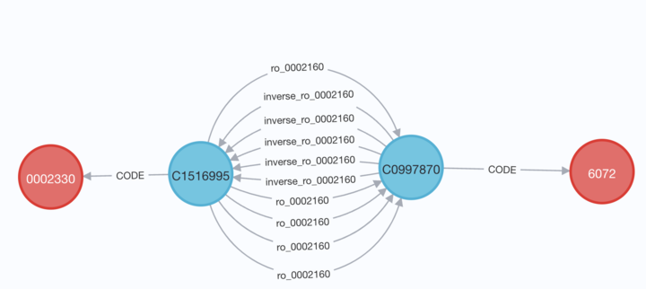
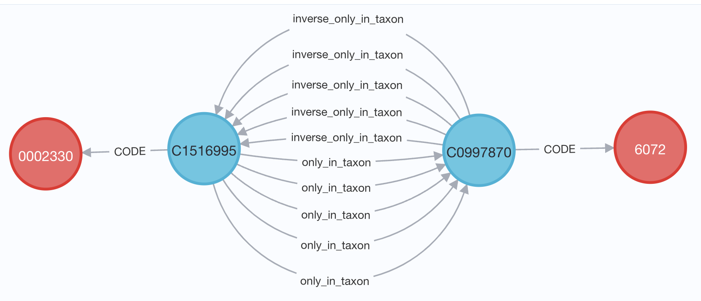

# Release Notes
## Unified Biological Knowledge Graph (UBKG)
### Generation Framework
### Version 3.5

# Bug Fixes

A bug was introduced as part of an enhancement to cast all relationship labels as lower case. 
Incomplete casting of all related data resulted in the loss of the translations of labels for relationships
that corresponded to IRIs in Relations Ontology. For example, an assertion between
a UBERON code and a CL code from a number of ingestions did not properly translate the
relationship for RO_0002160, or "only_in_taxon"

The script now correctly translates and casts as lowercase:

# Source Updates
The following ontologies are available from NCBO BioPortal. The generation framework 
was updated to point to the latest releases:
- ORDO
- EFO
- UO
- FALDO
- OBIB
- NPO (NPOKB)

