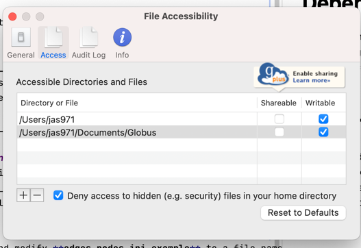

# Unified Biomedical Knowledge Graph

# ubkg_edges_nodes script

The scripts in this folder allow the UBKG generation framework to work with locally stored files in one of two formats:
1. a set of ingest files in UBKG edges/node format
2. a file serialized in one of the OWL formats

# Content
- **edges_nodes.py** - Does the following:
   - Reads a configuration file.
   - Examines the files in the local file path associated with an SAB.
   - If the files in the local path are in edges/nodes format, copies them to the appropriate path in the local repo.
   - If the files are not in edges/nodes format, assumes that the folder contains one OWL file. The script then processes the file with the PheKnowLator script.
  
- **edges_node.ini.example** - Annotated example of an ini file.

# Dependencies
1. Files in the **ubkg_utilities** folder:
   - ubkg_config.py
   - ubkg_logging.py
2. An application configuration file named **edges_nodes.ini.**
3. The directory specified in the ini file should contain either a set of files in edges/node format or a single OWL file.

# To run
1. Copy and modify **edges_nodes.ini.example** to a file named **edges_nodes.ini** in the current directory.
2. Configure the **ontologies.json** file at the generation_framework root to call edges_nodes.py with the appropriate SAB.

# Using with ingestion files stored in Globus
The anticipated use case for this script is a set of ingest files provided by a participant in the Data Distillery project.
Participants upload ingest files to secure locations in Globus collections.

The connection to Globus is not managed in the script--i.e., the script does not authenticate and download from Globus.
Instead, 
1. The local machine should have Globus Connect Personal installed.
2. Globus Connect should be connected by means of a valid Globus account.
3. The Globus Connect should be synchronized with the Globus collection. 
4. The **edges_nodes.ini** file should point to the local folder that is synchronized with the Globus collection.

## Setting up Globus Connect Personal

Globus offers extensive [documentation](https://docs.globus.org/faq/globus-connect-endpoints/?_gl=1*1y2ra39*_ga*NDkyMzg1OC4xNjgyMDEzNDg4*_ga_7ZB89HGG0P*MTY4MjAxMzQ4Ny4xLjEuMTY4MjAxMzUwNS4wLjAuMA..#how_can_i_create_an_endpoint) on how to set up an endpoint on a local machine.

The basic process is:
1. Install Globus Connect Personal.
2. Create a folder on the local machine.
3. In Globus Connect Personal, set up the local folder as an accessible directory. The following screen capture shows an example configuration on a Mac OSX machine; Globus Help has instructions for other operating systems.

4. From a Web browser, connect to Globus.
5. Navigate to the Globus remote collection from which to obtain source files.
6. Select the transfer button from the middle menu (with the bidirectional arrows).
7. Select the folders from the Globus collection to transfer.
8. Select Start.
9. In the right pane, select the collection that corresponds to the local machine.
10. Navigate to the folder to which to transfer files.
11. Initiate the transfer.